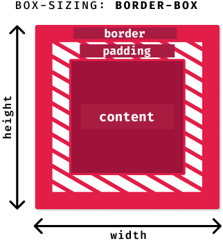
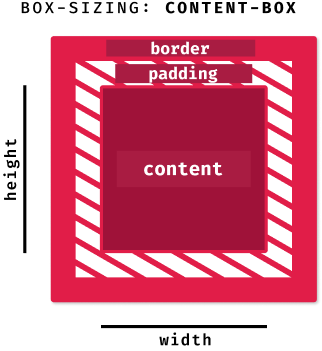
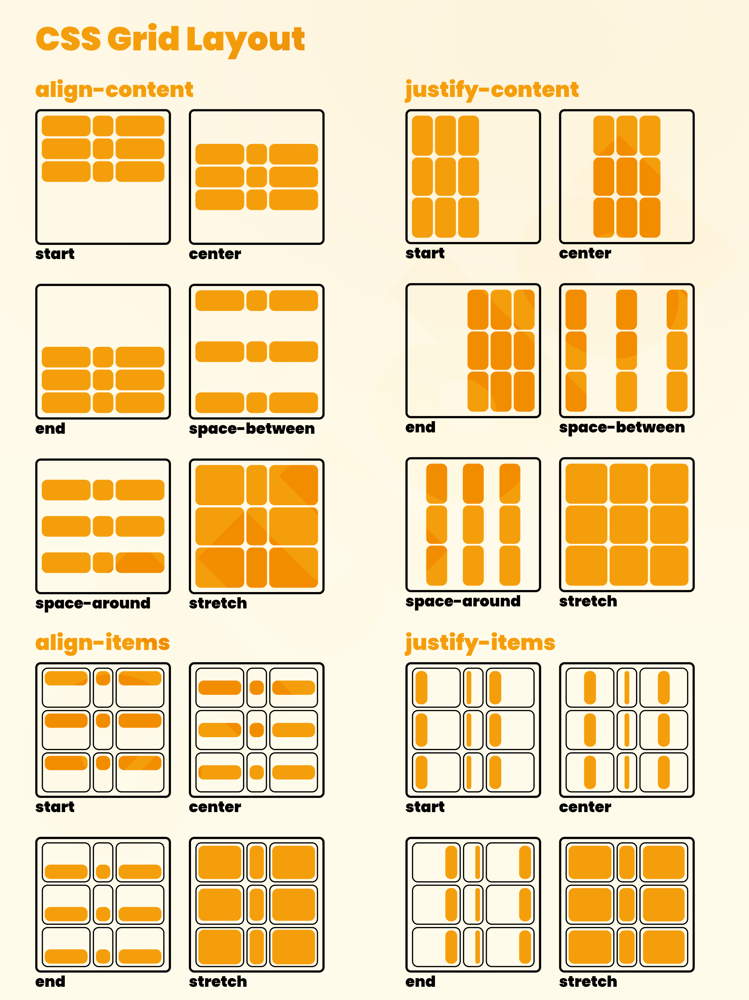
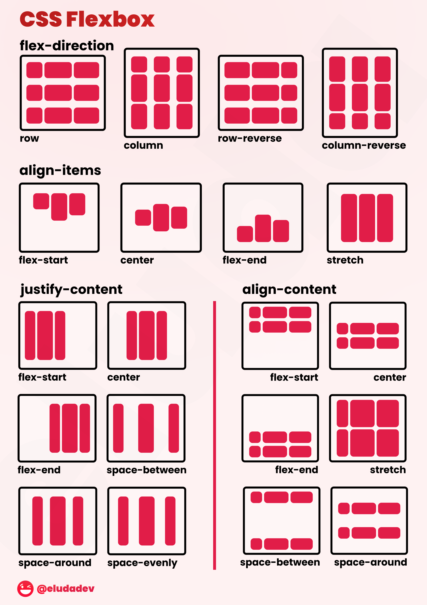

<h1 align="center"> 📦 CSS Box Model </h1>

 

## ✨ box-sizing: border-box

 
// The <b> width </b> and <b> height </b> have the size of <b>content</b> + <b>padding</b> + <b>border</b> 

 

  

## ✨ box-sizing: content-box

// The <b> width </b> and <b> height </b> have the size of just <b> content </b>

 

  

<h1 align="center"> 🍱 CSS Grid Layout </h1>

 

  

<h1 align="center"> 🎲 CSS Flexbox Layout </h1>

 

  