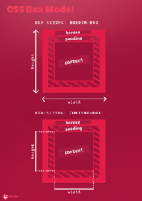

<h1 align="center"> 📦 CSS Box Model </h1>

 

## ✨ box-sizing: border-box
// The <mark> width </mark> and <mark> height </mark> have the size of <mark>content</mark>+<mark>padding</mark>+<mark>border</mark>
 

  

## ✨ box-sizing: content-box
// The <mark> width </mark> and <mark> height </mark> have the size of just <mark> content </mark>
 

  

## High Resolution

  

<h1 align="center"> 🍱 CSS Grid Layout </h1>

 

  

<h1 align="center"> 🎲 CSS Flexbox Layout </h1>

 

  